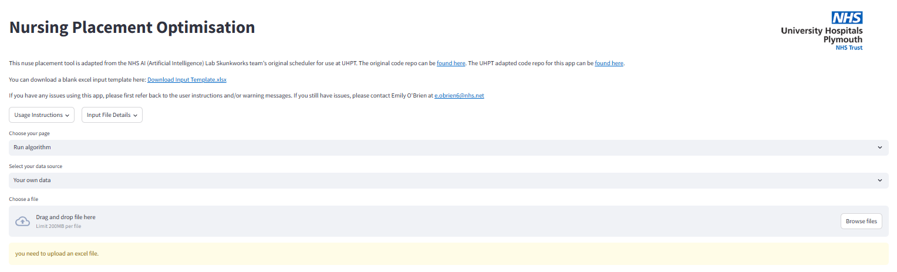

## User Interface
This document provides an overview of the User Interface (UI) and the meaning of various components

### Running the algorithm
When the UI first loads, several components will be visible initially:
| Component | Purpose |
| --------- | ------- |
| Information on the scheduler | Some information and links to the code repos and more detailed information about the scheduler. |
| "Download Input Template" link | Allows user to download a blank excel input template. |
| Contact details | Contact details for any questions/errors. |
| "Usage Instructions" pop-over | A button to bring up the usage instructions. |
| "Input File Details" pop-over | A button to bring up detailed information on what data should be filled into the input file. |
| "Choose your page" dropdown | This dropdown menu allows the user to switch between "Run algorithm", "Create Student Input Sheet" and "Documentation". The "Documentation" option allows the user to view more detailed documentation/instructions than in the pop-overs. |

### Create Student Input Sheet
The UI has the below component when the Create Student Input Sheet page is selected:
| Component | Purpose |
| --------- | ------- |
| "File Upload" | User can drag and drop or browse their files to upload the correct input document |

This page allows the user to upload the student information provided by the universities (provided it corresponds to the correct format (MORE INFO TO BE ADDED!!!!!!!!!!)).  This will run some code to transform this into the correct input required by the algorithm and provides a download link, so you can copy and paste into the students sheet on your algorithm input file.

### Run Algorithm
The UI has the below components when the Run Algorithm page is selected:
| Component | Purpose |
| --------- | ------- |
| "Select your data source" dropdown | Allows the user to choose between uploading their own data, or running with the fake data.  If fake data is chosen, a download link will appear below this, otherwise the below "File Upload" will appear. |
| "File Upload" | User can drag and drop or browse their files to upload the correct input document |
| "Start date" date selector | Appears once correct file has been uploaded. This allows the user to choose the earliest date for which placements should be allocated. This should auto-populate with the correct date. |
| "End date" date selector | Appears once correct file has been uploaded. This allows the user to choose the latest date for which placements should be allocated. This should auto-populate with the correct date.  |
| "Choose number of schedules to generate" slider | Appears once correct file has been uploaded. this allows the user to choose the number of times that the algorithm will run, and subsequently how many options will be offered to them at the end. |

Below these components may be several warnings/errors to flag to the user some issues in the input file:
- A table of the Student and Capacity counts will appear, with red error messages below if there are more students than capacity will allow.
- All the mismatched courses (if exists):
    - An initial red error box detailing how mant students are on courses with no match in the placements tab
    - A yellow error box listing all the names of the students on the course shown in the table below this, which doesn't match to the placements tab (repeated for all the courses/students that don't match)
    - A red error box and a table below detailing the courses in the placements tab which don't have any students assigned to them.  This may be that there is a typo of one of the above courses that students are on, so they don't match.  If this is the case, please amend and reupload the input file to fix this.  If this is not the case, consider deleting this course from the input file for neatness (the algorithm will still run if additional courses are included, they will just be ignored).
- A red error box and yellow warning box detailing the wards whose education audits have expired, or will expire during the placement period. 

Whether or not these boxes appear will depend on if there are any mismatches in the input files and the Education Audit Status of your wards. Blue boxes will appear if there are no issues in each section. Note that the Education Audit Expiry date warnings **DO NOT** prevent students from going on placement at that ward. When each final schedule is produced, a list of wards with expired Education Audits will be generated as part of the detailed schedule, to demonstrate the wards which must have an Education Audit completed before placements can be accepted.

Finally, below this will be the "Click here to start running" button. When pressed, this will begin running the algorithm with the settings configured using the components above.

### While the algorithm runs
While the tool is running, some live information will be displayed to help you keep track of the progress. Information will be displayed for each schedule being produced including the following:
| Field | Explanation |
| ----- | ----------- |
| Schedule # being generated | this is simply to help keep count of how many schedules have been generated so far out of the number requested |
| Current schedule version being generated | this shows the progress of the algorithm and will count up as it tries to produce the best possible schedule |
| Highest schedule fitness score | this is the current highest score of the schedules which have been generated. This score should increase while the tool runs, but may reach a point where it can no longer improve the best schedule. |

With each schedule that is finished, a table will be displayed summarising some key information about each schedule (you may need to scroll across this table to view all the information). This information includes:
| Field | Explanation |
| ----- | ----------- |
| Schedule file name | This is the name of the schedule iteration |
| Viable schedule? | This immediately tells you whether or not the schedule satisfies all of the [constraints](constraints.md) specified |
| Number of iterations to generate | This tells you how many cycles of the algorithm it took to produce the final schedule |
| Schedule Fitness Score | This is the fitness score of each schedule produced. These scores are mostly useful to compare schedules to each other |
| Placement Utilisation Score | This is the average % utilisation of placement capacity on each ward |
| Unique Specialities Score | This is the average % of terms which are unique in the list of all specialities that a student has been on placement at |
| Unique Wards Score | This is the average % of wards which are unique where a student has been on placement |
| No. students with incorrect no. of placements | This is the number of students who have too many or too few placements (in most cases this will be 0) |
| No. of placements with the incorrect length  | This is the number of placements which are longer or shorter than they need to be (in most cases this will be 0) |
| No. of ward-weeks where capacity is exceeded | This is the number of ward-weeks where too many students (either overall or of a specific year) are allocated to a ward |
| No. of placements where student is double-booked | This is the number of placements where a student is assigned to more than 1 ward at a time |

#### Example calculation of Unique Specialities and Unique Wards Scores
The Unique Specialities and Unique Wards Scores are important drivers in encourgaing the algorithm to allocate a selection of placements to students which help them to experience a diverse range of skills. In addition, these scoring metrics can help placement coordinators to compare schedules and see the pros and cons of each of the options.
To illustrate how these scores would be calculated, here is a simple example

##### Unique Specialities Score
If Student A goes on placements at wards or teams specialising in (these specialities are for demonstration purposes only) 'Critical and Emergency Care', 'Abdominal Surgery', 'Cardiac Surgery', 'District Nursing' and 'Elderly Rehabilitiation Care', they will have 13 words which describe the specialities they have had placements in. Of those 13 words, 11 are unique, so the Unique Specialities Score for this student would be 11/13 = 0.846. This calculation is carried out for each student, and the score displayed on the UI is the average of all scores.

##### Unique Wards Score
If Student B goes on placements at the following wards: 'Ward A', 'Ward G', 'Ward C', 'Ward M', 'Ward A', 'Ward P', the student will have completed 6 placements in total. However they will have only experienced 5 unique wards, so their Unique Wards Score would be 0.833. This calculation is carried out for each student, and the score displayed on the UI is the average of all scores.

### After the algorithm has run
Once the algorithm has finished running, some balloons will appear, as well as a green box stating 'Schedule production complete!'. This indicates that all of the requested schedules have been produced and are ready for human review.

Download links for the comparison file and the output from each individual run will appear at the very bottom of the page.

**Note**: If you upload a file into either the "Run Algorithm" or "Create Student Input Sheet" pages, and then switch to the other, the file will remain and a red error message will appear prompting you to change the input file.
