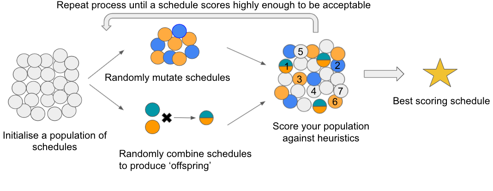

## Genetic Algorithm
This document provides an overview of how the Genetic Algorithm in this tool works, to provide an accesible point of reference when reviewing the code

### How it works

The basic process for the algorithm is as follows:
1. Randomly generate N schedules, utilising the required start dates for 
   each placement.
2. From the population of schedules, randomly choose some schedules to have 
   P mutations performed on them. In this context, a mutation is randomly 
   moving a placement from one ward to another. For more information on mutating, please see [here](https://en.wikipedia.org/wiki/Mutation_(genetic_algorithm)
3. Additionally from the population of schedules, choose Q parents to be used
   to generate 'offspring'. Parents are selected using a ranked roulette wheel
   where the probability of being chosen is proportional to the fitness of the
   schedule. Offspring are produced by using recombination (sometimes also 
   referred to as crossover) to combine two schedules using a pre-defined
   number of crossover points. For more information on recombination, please see [here](https://en.wikipedia.org/wiki/Crossover_(genetic_algorithm))
4. The mutated schedules and the offspring are then used to replace the least
   fit schedules in the population, improving the overall fitness of the 
   population.
5. Steps 2-4 are then iterated until either:
    1. A schedule which reaches a minimum level of fitness is identified 
    AND the schedule is viable. In this case, the schedule which meets these 
    requirements is saved down.
    2. There has been no change in the highest ranking schedule's fitness score
    for a pre-defined number of iterations. In this case, the best scoring
    schedule is saved down, regardless of whether the schedule is viable, this
    is to prevent the algorithm from running for too long.
6. The algorithm (steps 1-5) is run X times (defined by the user) to produce 
   X schedules for the placement coordinator to consider the benefits of 
   each option.

### Genetic Algorithm object
The Genetic Algorithm object is what drives the process behind the tool, orchestrating the generation, evolution and evaluation of the schedules to determine the option that best matches the criteria. It is generated from [ui.py](../ui.py), which creates the object once the `Run algorithm` button has been pressed.

### Key functions
#### seed_schedules
This function is run once per run of the tool. For the user-specificed number of schedules, it generates schedules, gets their fitness score and saves them down.

#### viable_schedule_check
This function is what determines whether a satisfactory schedule has been identified before early stopping criteria are met. It checks whether a schedule meets a score threshold and is viable

#### status_update
This function provides a command line update as to the current best scoring schedule

#### no_change_check
This function checks whether an improvement in the best schedule fitness has been found. If no change is found for a user-specified number of iterations, the tool is stopped and the best scoring schedule at that time is selected.

#### evaluate
This function calls several smaller functions (`viable_schedule_check`, `status_update`, `no_change_check`) to determine whether a suitable schedule has been found

#### execute_mutation
This function determines which schedules should be mutated. It uses a simple random number comparison

#### select_parents
This function selects which sets of two schedules will be recombined. This is done using a roulette wheel approach (this means that the fitness of the schedule is proportional to the probability of a schedule being selected. This means higher scoring schedules are more likely to be selected)

#### generate_offspring
This function uses parents selected in `select_parents` to produce combinations of the two schedules

#### culling
This function generates brand new schedules to prevent the population from stagnating

#### update_population
This function takes new schedules produced by `execute_mutation`, `generate_offspring` and `culling` and replaces the worst scoring schedules with the newly produced ones.

#### evolve
This function is similar to `evaluate` in that in orchestrates a range of smaller function (`culling`,`execute_mutation`,`generate_offspring`,`select_parents`,`update_population` and `evaluate`) to run cycles of evolution of the schedules